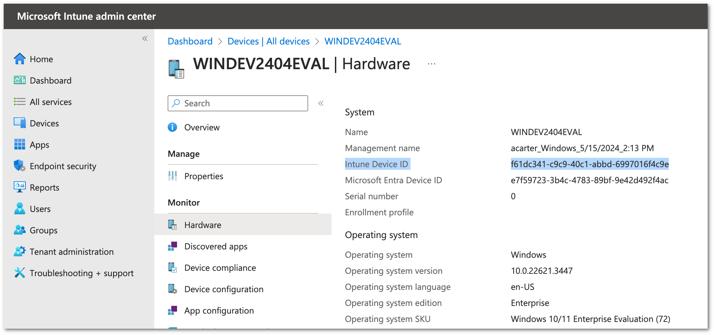
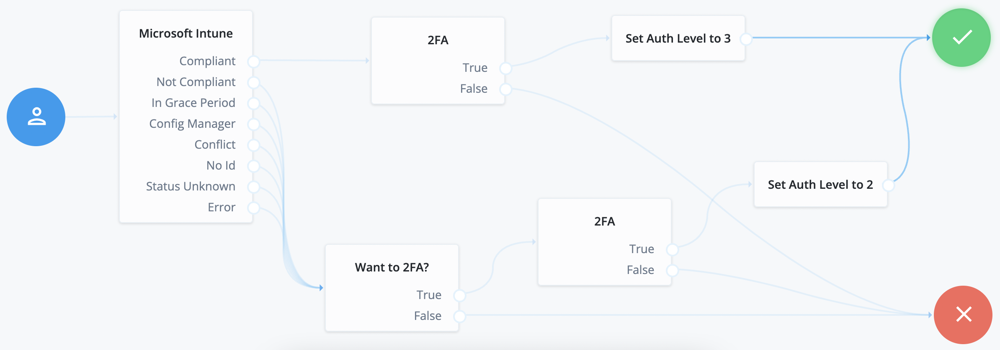

<!--
* The contents of this file are subject to the terms of the Common Development and
* Distribution License (the License). You may not use this file except in compliance with the
* License.
*
* You can obtain a copy of the License at legal/CDDLv1.0.txt. See the License for the
* specific language governing permission and limitations under the License.
*
* When distributing Covered Software, include this CDDL Header Notice in each file and include
* the License file at legal/CDDLv1.0.txt. If applicable, add the following below the CDDL
* Header, with the fields enclosed by brackets [] replaced by your own identifying
* information: "Portions copyright [year] [name of copyright owner]".
*
* Copyright 2018 ForgeRock AS.
-->
# Microsoft Intune Node


This node integrates with Microsoft Intune via Graph API. It evaluates the device's compliance posture and returns the result. It can also save device information to the SharedState that can subsequently be used by other nodes.


From Microsoft - "Important: Microsoft Graph APIs under the /beta version are subject to change; production use is not supported."


##  Configuration properties of the node


- DeviceID Attribute Name
   >This is the value of the SSL_Client_S_DN from the client certificate presented at the TLS termination gateway. The default location for this value is expected in the Request Header. Format should be CN=f47d8e59-b60e-48a5-adc1-622cb2244zzz
- DeviceID in SharedState
   >The default location for DeviceID is expected to be in the Header.  Setting this value to true indicates looking in the SharedState for the DeviceID instead of the Header. The format is the same: CN=f47d8e59-b60e-48a5-adc1-622cb2244zzz
- Directory (tenant) ID
   >Tenant Id is the Azure Active Directory's Global unique identifier (GUID)
- Application (client) ID
   >The application ID, or client ID, is a value the Microsoft identity platform assigns to your application when you register it in Azure AD.
- Client Secret
   >Sometimes called an application password, a client secret is a string value your app can use in place of a certificate to identify itself.
- Azure Admin User Name
   >This is the administrative username.
- Azure Admin User Password
   >This is the administrative password.
- Save Device Properties to Shared State
   >If enabled, all device info will be saved to the SharedState with INTUNE_ prepended to the key name. Null and empty string values will not be placed into SharedState.  Details on possible return properties can be found [here](https://learn.microsoft.com/en-us/graph/api/resources/intune-devices-manageddevice?view=graph-rest-beta#properties).
- Save installed apps to Shared State
   >If enabled, the apps installed on the Mobile Device are extracted and saved to the Shared State with the key name - INTUNE_INSTALLED_APPS


## Outcomes


The following details have been derived from the Compliance State found [here](https://learn.microsoft.com/en-us/graph/api/resources/intune-devices-compliancestate?view=graph-rest-beta).
- Compliant
   > Take if the device is compliant
- Not Compliant
   > Take if the device is not compliant
- In Grace Period
   > Take if the device is not compliant but still has access to corporate resources
- Config Manager
   > Take if Managed by Config Manager
- Conflict
   > Take if a conflict occurs with other rules
- No Id
   > Take if no DeviceId found in the Header or SharedState
- Status Unknown
   > Take if unknown
- Error
   > Take if any error occurs, the stacktrace and message are placed in the SharedState


## Prerequisite


Note: The Microsoft Graph API for Intune requires an active Intune license for the tenant.


The DeviceId needs to be obtained from the TLS handshake.  That DeviceId needs to be placed in the Header between a proxy and Identity Cloud or needs to be placed in the SharedState.  Either way needs to occur before reaching this Microsoft Intune Node. 

### cURL Commands that can be used to verify Intune setup
Here are two cURL commands that can be used to verify your Intune setup before using the node:
1. This first command retrieves the Access Token needed by the Intune node:
> Request
```curl 
curl --location 'https://login.microsoftonline.com/<tenant ID>/oauth2/v2.0/token' \
--header 'Content-Type: application/x-www-form-urlencoded' \
--data-urlencode 'client_id=<application client ID>' \
--data-urlencode 'client_secret=<client secret>' \
--data-urlencode 'scope=https://graph.microsoft.com/.default' \
--data-urlencode 'grant_type=password' \
--data-urlencode 'username=<Azure admin username>' \
--data-urlencode 'password=<Azure admin pwd>'
```
> Expected Response
```json
{
    "token_type": "Bearer",
    "scope": "profile openid email https://graph.microsoft.com/DeviceManagementManagedDevices.Read.All https://graph.microsoft.com/User.Read https://graph.microsoft.com/.default",
    "expires_in": 3971,
    "ext_expires_in": 3971,
    "access_token": "<this will be the jwt token used by the retrieve the device info cURL command below>"
}
```

2. This second command retrieves the device info:
> Request
```curl
curl --location 'https://graph.microsoft.com/v1.0/deviceManagement/manageddevices/<Intune Device ID>' \
--header 'Authorization: Bearer <this is the jwt token returned by the cURL command above>'
```
> Expected Response
```json
{
    "@odata.context": "https://graph.microsoft.com/v1.0/$metadata#deviceManagement/managedDevices/$entity",
    "id": "f61dc341-c9c9-40c1-abbd-6997016f4c9e",
    "userId": "0f7e78ba-6e1f-485b-8b8b-fb86895f0498",
    "deviceName": "WINDEV2404EVAL",
    "managedDeviceOwnerType": "company",
    "enrolledDateTime": "2024-05-15T14:13:19.376941Z",
    "lastSyncDateTime": "2024-05-16T03:45:42.4309247Z",
    "operatingSystem": "Windows",
    "complianceState": "compliant",
    "jailBroken": "Unknown",
    "managementAgent": "mdm",
    "osVersion": "10.0.22621.3447",
    "easActivated": true,
    "easDeviceId": "24783A3196BAFE89291A012E4B607591",
    "easActivationDateTime": "2024-05-15T14:25:40.632661Z",
    "azureADRegistered": true,
    "deviceEnrollmentType": "windowsAzureADJoin",
    "activationLockBypassCode": null,
    "emailAddress": "cyril.grosjean+acarter-wkf-poc-stg@forgerock.com",
    "azureADDeviceId": "e7f59723-3b4c-4783-89bf-9e42d492f4ac",
    "deviceRegistrationState": "registered",
    "deviceCategoryDisplayName": "",
    "isSupervised": false,
    "exchangeLastSuccessfulSyncDateTime": "0001-01-01T00:00:00Z",
    "exchangeAccessState": "none",
    "exchangeAccessStateReason": "none",
    "remoteAssistanceSessionUrl": "",
    "remoteAssistanceSessionErrorDetails": "",
    "isEncrypted": false,
    "userPrincipalName": "acarter@pingidentity-stg-poc.work.gd",
    "model": "VirtualBox",
    "manufacturer": "innotek GmbH",
    "imei": null,
    "complianceGracePeriodExpirationDateTime": "9999-12-31T23:59:59.9999999Z",
    "serialNumber": "0",
    "phoneNumber": null,
    "androidSecurityPatchLevel": null,
    "userDisplayName": "acarter",
    "configurationManagerClientEnabledFeatures": null,
    "wiFiMacAddress": null,
    "deviceHealthAttestationState": null,
    "subscriberCarrier": "",
    "meid": null,
    "totalStorageSpaceInBytes": 133661982720,
    "freeStorageSpaceInBytes": 74671194112,
    "managedDeviceName": "acarter_Windows_5/15/2024_2:13 PM",
    "partnerReportedThreatState": "unknown",
    "requireUserEnrollmentApproval": null,
    "managementCertificateExpirationDate": "2025-05-15T03:56:04Z",
    "iccid": "",
    "udid": "",
    "notes": null,
    "ethernetMacAddress": "08002732B5A2",
    "physicalMemoryInBytes": 0,
    "enrollmentProfileName": "",
    "deviceActionResults": []
}
```
### Correct Device ID
Please ensure you are using the correct Device ID when performing the verification test above.  You can retrieve the **Intune Device ID** from the Hardware section within Entra



##  Additional Steps for Self-Managed Install
For self-managed deployments, copy the .jar file from the ../target directory into the ../web-container/webapps/openam/WEB-INF/lib directory where AM is deployed.  Restart the web container to pick up the new node.  The node will then appear in the authentication trees components palette.


## Sample Tree





The code in this repository has binary dependencies that live in the ForgeRock maven repository. Maven can be configured to authenticate to this repository by following the following [ForgeRock Knowledge Base Article](https://backstage.forgerock.com/knowledge/kb/article/a74096897).
      
The sample code described herein is provided on an "as is" basis, without warranty of any kind, to the fullest extent permitted by law. ForgeRock does not warrant or guarantee the individual success developers may have in implementing the sample code on their development platforms or in production configurations.


ForgeRock does not warrant, guarantee or make any representations regarding the use, results of use, accuracy, timeliness or completeness of any data or information relating to the sample code. ForgeRock disclaims all warranties, expressed or implied, and in particular, disclaims all warranties of merchantability, and warranties related to the code, or any service or software related thereto.


ForgeRock shall not be liable for any direct, indirect or consequential damages or costs of any type arising out of any action taken by you or others related to the sample code.


[forgerock_platform]: https://www.forgerock.com/platform/ 


